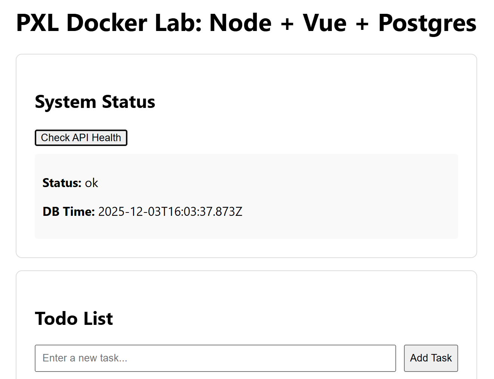
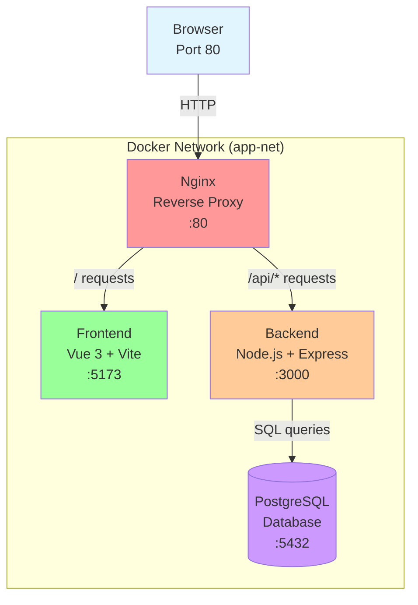

# Docker Compose Lab: Node, Vue, Postgres & Nginx



A production-ready **reference architecture for a full-stack application using Docker Compose**. This repository demonstrates the differences between **Development** (hot-reloading, bind mounts) and **Production** (multi-stage builds, static assets, immutable images) workflows.

- [Stack Architecture](#stack-architecture)
- [Network Architecture:\*\*](#network-architecture)
- [Getting Started](#getting-started)
  - [Configuration (Secrets)](#configuration-secrets)
  - [Run in Development Mode](#run-in-development-mode)
  - [Run in Production Mode (Simulated)](#run-in-production-mode-simulated)
- [Development Workflow](#development-workflow)
  - [1. Open the Project](#1-open-the-project)
  - [2. Start the Environment](#2-start-the-environment)
  - [3. Connect VS Code to the Container](#3-connect-vs-code-to-the-container)
  - [4. Initialize the Workspace (First Time Only)](#4-initialize-the-workspace-first-time-only)
  - [5. Your Dev Environment](#5-your-dev-environment)
  - [6. Managing the Database](#6-managing-the-database)
- [Project Structure](#project-structure)
- [Key Concepts \& Best Practices](#key-concepts--best-practices)
  - [Nginx as a Reverse Proxy](#nginx-as-a-reverse-proxy)
  - [Networking](#networking)
  - [Multi-Stage Builds (Production)](#multi-stage-builds-production)
  - [Database Persistence](#database-persistence)
  - [Security Basics](#security-basics)
- [CI/CD Pipeline (GitHub Actions)](#cicd-pipeline-github-actions)
  - [Setup Instructions](#setup-instructions)
    - [1. Generate Token (Docker Hub)](#1-generate-token-docker-hub)
    - [2. Add Secrets (GitHub)](#2-add-secrets-github)
    - [3. Update Workflow Config](#3-update-workflow-config)
- [Troubleshooting](#troubleshooting)

## Stack Architecture

| Service | Technology | Role |
| :--- | :--- | :--- |
| **Proxy** | Nginx (Alpine) | Entry point, reverse proxy, serves static files (Prod) |
| **Frontend** | Vue 3 + Vite | Single Page Application (SPA) |
| **Backend** | Node 22 + Express | REST API |
| **Database** | PostgreSQL 16 | Persistent data storage |

## Network Architecture:**



-----

## Getting Started

### Configuration (Secrets)

We use environment variables to configure the app.

>Do not commit actual secrets to Git. Provide a template file `.env.example` instead.

1. Copy the example file:

   ```bash
   cp .env.example .env
   ```

2. (Optional) Edit `.env` to set your own `POSTGRES_PASSWORD`.

### Run in Development Mode

*Focus: Speed, debugging, and live updates.*

```bash
docker compose up --build
```

- **URL:** Open <http://localhost>
- **Hot Reloading:**
  - Edit `frontend/src/App.vue`: Browser updates instantly (Hot Module Replacement).
  - Edit `backend/src/index.js`: Backend restarts automatically (Nodemon).
- **Logs:** Streamed directly to your terminal.

To stop: Press `Ctrl+C`.

### Run in Production Mode (Simulated)

*Focus: Performance, stability, and security.*

```bash
docker compose -f compose.prod.yaml up --build
```

- **What changes?**
  - **Frontend:** The `nginx/Dockerfile.prod` runs a **Multi-Stage Build**. It compiles Vue into static HTML/CSS/JS and discards the Node environment, resulting in a tiny Nginx image serving raw files.
  - **Backend:** Runs with `node` instead of `nodemon`.
  - **Secrets:** *Note: In this lab, we still read from `.env`. In a real production environment, secrets are injected via a vault (e.g., [AWS Secrets Manager](https://aws.amazon.com/secrets-manager/), [HashiCorp Vault](https://www.hashicorp.com/en/products/vault)), not a file.*

-----

## Development Workflow

This project is designed to run entirely inside Docker. You do not need Node.js, PostgreSQL, or other tools installed on your host machine.

### 1\. Open the Project

Open your terminal (Command Prompt, PowerShell, or Terminal) and navigate to the (github repo) project folder.

Start Visual Studio Code in this folder:

```bash
code .
```

### 2\. Start the Environment

In VS Code, open the integrated terminal (`Ctrl` + `` ` ``) and run:

```bash
docker compose up --build
```

*Wait for the logs to say the backend and database are ready.*

### 3\. Connect VS Code to the Container

To get IntelliSense, Git integration, and terminal access, we must "Attach" VS Code to the running backend container.

1. Press `F1` (or `Ctrl+Shift+P`) to open the Command Palette.
2. Type and select: **Dev Containers: Attach to Running Container...**
3. Select the backend service (e.g., `lab-dev-backend-1`).
4. **A new VS Code window will open.**

### 4\. Initialize the Workspace (First Time Only)

The new window might show an empty screen or the wrong folder.

1. In the new window, click the blue **Open Folder** button (or go to **File \> Open Folder**).
2. Type exactly: `/workspace`
3. Click **OK**.

### 5\. Your Dev Environment

You are now working inside the container.

- **Edit Code:** Full IntelliSense is active. Edit files normally; they save instantly to your host machine.
- **Terminal:** The terminal in this window is a Linux shell.
- **Git:** You can use the Source Control tab or run `git` commands in the terminal (e.g., `git commit -m "wip"`).
- **NPM:** Run commands directly: `npm install uuid`.

### 6\. Managing the Database

To inspect the database, open a terminal **inside the attached VS Code window**:

```bash
# Connect to Postgres
psql -h db -U appuser -d appdb
```

- `\dt` : List tables
- `select * from todos;` : View data
- `\q` : Quit

-----

## Project Structure

```text
.
├── compose.yaml              # Orchestrates the DEV environment
├── compose.prod.yaml         # Orchestrates the PROD environment
├── .env                      # Local secrets (gitignored)
├── backend/
│   ├── Dockerfile            # Node setup
│   └── src/                  # API logic
├── frontend/
│   ├── Dockerfile            # Dev-only setup
│   └── vite.config.js        # Vite config
├── nginx/
│   ├── Dockerfile.prod       # PROD: Builds Vue app + Configures Nginx
│   ├── nginx.dev.conf        # DEV: Proxies to Vite dev server
│   └── nginx.prod.conf       # PROD: Serves static files + proxies API
└── db/
    └── init.sql              # Database seed script
```

-----

## Key Concepts & Best Practices

### Nginx as a Reverse Proxy

Instead of accessing the Node API (`:3000`) or Vite (`:5173`) directly, we route everything through Nginx on port `80`.

This solves [CORS](https://developer.mozilla.org/en-US/docs/Web/HTTP/Guides/CORS) issues (same origin) and mimics real-world deployment where the internal network is hidden from the public internet.

### Networking

We use a custom bridge network `app-net`. Containers talk to each other by **service name**.

- The Backend talks to Postgres via `DB_HOST: db`.
- Nginx talks to the Backend via `http://backend:3000`.

### Multi-Stage Builds (Production)

Look at `nginx/Dockerfile.prod`. It has two stages:

1. **Build Stage:** Uses a heavy Node image to install dependencies and compile the Vue app.
2. **Production Stage:** Copies *only* the `dist/` folder from stage 1 into a lightweight Nginx image.

<!-- end list -->

- **Result:** A smaller, more secure image without source code or `node_modules`.

### Database Persistence

Postgres data is stored in a **Docker Volume** (`db-data`).

- If you delete the container, the data persists.
- **To reset the database:**
  
  ```bash
  docker compose down -v
  ```

  *(The `-v` flag deletes the volumes)*.

### Security Basics

- **Non-root User:** The Backend Dockerfile switches to `USER node` to prevent the application from having root access to the container OS.
- **Graceful Shutdown:** The Node app listens for `SIGTERM` signals to close database connections properly before the container stops.

-----

## CI/CD Pipeline (GitHub Actions)

This repository includes a `.github/workflows/ci-cd.yml` file to automatically build and push images to Docker Hub when you push code.

### Setup Instructions

To enable the workflow on your own fork, you need to provide your Docker Hub credentials to GitHub.

#### 1\. Generate Token (Docker Hub)

1. Log in to [Docker Hub](https://hub.docker.com/).
2. Go to **Account Settings \> Security**.
3. Click **New Access Token**.
4. **Description:** `GitHub Actions`
5. **Access Permissions:** Read, Write, Delete.
6. **Copy** the generated token (starts with `dckr_pat_...`).

#### 2\. Add Secrets (GitHub)

*Do not put these in "Variables". They must be "Secrets".*

1. Go to your GitHub Repository.
2. Click **Settings** (top tab) \> **Secrets and variables** (left menu) \> **Actions**.
3. Under the **Repository secrets** section, click **New repository secret**.
4. Add the **Username**:
      - **Name:** `DOCKERHUB_USERNAME`
      - **Secret:** Your actual Docker Hub username (e.g., `jdoe123`).
5. Add the **Token**:
      - **Name:** `DOCKERHUB_TOKEN`
      - **Secret:** Paste the `dckr_pat_...` token you copied earlier.

#### 3\. Update Workflow Config

1. Open `.github/workflows/ci-cd.yml` in your code editor.
2. Edit the `env` section near the top:

    ```yaml
    env:
      # Replace with YOUR Docker Hub username
      DOCKERHUB_USERNAME: jdoe123
      # Replace with YOUR desired image names
      BACKEND_IMAGE: jdoe123/lab-backend
      WEB_IMAGE: jdoe123/lab-web
    ```

3. Commit and push these changes to the `main` branch. This will trigger your first build.
  
-----

## Troubleshooting

**"Port is already allocated"**
Stop any other Postgres or Web servers running on your machine, or modify the `ports` mapping in `compose.yaml`.

**"Connection refused" between Backend and DB**
Wait a few seconds. Postgres takes longer to start than Node. The `depends_on: service_healthy` check in the compose file usually handles this, but on slow machines, it might time out.

**Changes not showing in Dev?**
Ensure you are using `compose.yaml` (Dev) and not `compose.prod.yaml` (Prod). Prod images are immutable; they do not watch your files.
