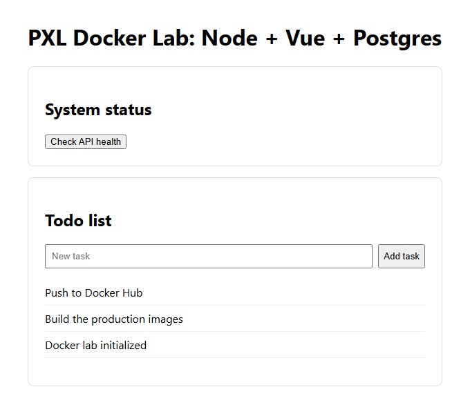

# Docker full-stack lab: Node, Vue, PostgreSQL and NGINX



The finished project of two labs of the PXL Docker course:

- Full stack, development: <https://pxl-systems-advanced.github.io/docker-labs/#/labs/lab-fullstack-dev>
- Full stack, production: <https://pxl-systems-advanced.github.io/docker-labs/#/labs/lab-fullstack-prod>

Clone it with the GitHub CLI, or with Git:

```bash
gh repo clone PXL-Systems-Advanced/docker-node-vue-postgres-nginx-lab
git clone https://github.com/PXL-Systems-Advanced/docker-node-vue-postgres-nginx-lab.git
```

## Run it

Create your settings from the template first:

```bash
cp .env.example .env
```

Start the development environment. Compose Watch copies every saved file into the containers:

```bash
docker compose watch
```

Or build and start the production environment:

```bash
docker compose -f compose.prod.yaml up -d --build
```

Both serve the application on <http://localhost:8080>.

## Files

The project contains:

- `compose.yaml`: development, with Compose Watch. The database is on its own network, out of reach of NGINX.
- `compose.prod.yaml`: production, built from `backend/Dockerfile.prod` and `nginx/Dockerfile.prod`.
- `compose.deploy.yaml`: production, with the images that the workflow pushed to Docker Hub.
- `.github/workflows/ci-cd.yml`: builds both production images, and pushes them for a push to `main`. It needs the repository secrets `DOCKER_HUB_USERNAME` and `DOCKER_HUB_ACCESS_TOKEN`.

The labs explain every file.
